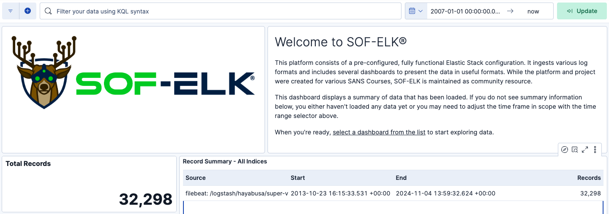
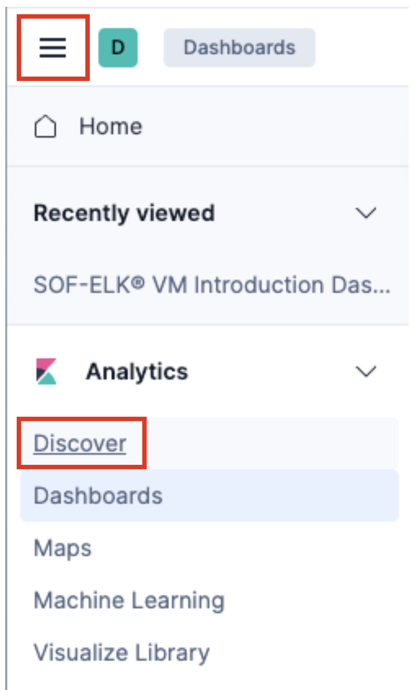
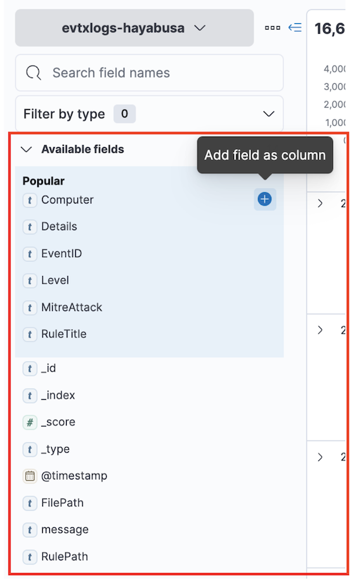
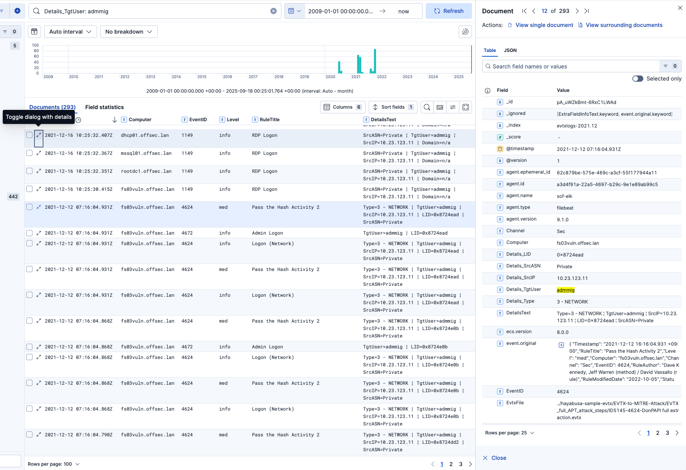

- [Importing Results Into SOF-ELK (Elastic Stack)](#importing-results-into-sof-elk-elastic-stack)
  - [Install and start SOF-ELK](#install-and-start-sof-elk)
    - [Network connectivity trouble on Macs](#network-connectivity-trouble-on-macs)
  - [Update SOF-ELK!](#update-sof-elk)
  - [Run Hayabusa](#run-hayabusa)
  - [Optional: Deleting old imported data](#optional-deleting-old-imported-data)
  - [Configure the Hayabusa logstash config file in SOF-ELK](#configure-the-hayabusa-logstash-config-file-in-sof-elk)
  - [Import Hayabusa results into SOF-ELK](#import-hayabusa-results-into-sof-elk)
  - [Check that the import worked in Kibana](#check-that-the-import-worked-in-kibana)
  - [View results in Discover](#view-results-in-discover)
  - [Analyzing results](#analyzing-results)
    - [Adding columns](#adding-columns)
    - [Filtering](#filtering)
    - [Toggling Details](#toggling-details)
    - [View surrounding documents](#view-surrounding-documents)
    - [Get quick metrics on fields](#get-quick-metrics-on-fields)
  - [Future Plans](#future-plans)


# Importing Results Into SOF-ELK (Elastic Stack)

## Install and start SOF-ELK

Hayabusa results can easily be imported into Elastic Stack.
We recommend using [SOF-ELK](https://github.com/philhagen/sof-elk), a free elastic stack Linux distro focused on DFIR investigations.

First download and unzip the SOF-ELK 7-zipped VMware image from [https://github.com/philhagen/sof-elk/wiki/Virtual-Machine-README](https://github.com/philhagen/sof-elk/wiki/Virtual-Machine-README).

There are two versions, x86 for Intel CPUs and an ARM version for Apple M-series computers.

When you boot up the VM, you will get a screen similar to this:


Take note of the Kibana URL and IP address of the SSH server.

You can log in with the following credentials:
* Username: `elk_user`
* Password: `forensics`

Open Kibana in a web browser according to the URL displayed.
For example: http://172.16.23.128:5601/

> Note: it may take a while for Kibana to load.

You should see a webpage as follows:


We recommend that you SSH into the VM instead of typing commands inside the VM with `ssh elk_user@172.16.23.128`.

> Note: the default keyboard layout is the US keyboard.

### Network connectivity trouble on Macs

If you are on macOS and you get a `no route to host` error in the terminal or you cannot access Kibana in your browser, it is probably due to macOS's local network privacy controls.

In `System Settings`, open up `Privacy & Security` -> `Local Network` and make sure that your browser and terminal program are enabled to be able to communicate with devices on your local network.

## Update SOF-ELK!

Before importing data, be sure to update SOF-ELK with the `sudo sof-elk_update.sh` command.

## Run Hayabusa

Run Hayabusa and save results to JSONL.

Ex: `./hayabusa json-timeline -L -d ../hayabusa-sample-evtx -w -p super-verbose -G /opt/homebrew/var/GeoIP -o results.jsonl`

## Optional: Deleting old imported data

If this is not the first time to import Hayabusa results and you want to clear everything out, you can do so with the following:

1. Check what records are currently in SOF-ELK: `sof-elk_clear.py -i list`
2. Delete the current data: `sof-elk_clear.py -a`
3. Delete the files in the logstash directory: `rm /logstash/hayabusa/*`

## Configure the Hayabusa logstash config file in SOF-ELK

There is already a Hayabusa logstash config file included in SOF-ELK that converts field names into Elastic Common Schema format.
If you are more comfortable with Hayabusa field names, we recommened to use the one we provide.

1. First SSH into SOF-ELK: `ssh elk_user@172.16.23.128`
2. Delete or move the current logstash config file: `sudo rm /etc/logstash/conf.d/6650-hayabusa.conf`
3. Upload the new [6650-hayabusa-jsonl.conf](6650-hayabusa-jsonl.conf) file to `/etc/logstash/conf.d/`: `sudo wget https://raw.githubusercontent.com/Yamato-Security/hayabusa/main/doc/ElasticStackImport/6650-hayabusa-jsonl.conf -O /etc/logstash/conf.d/6650-hayabusa.conf`.
4. Reboot logstash: `sudo systemctl restart logstash`

This config file will create consolidated `DetailsText` and `ExtraFieldInfoText` fields that let you quickly see the most important fields at a glance instead of having to take time opening up each record one at a time to look through all of the fields.

## Import Hayabusa results into SOF-ELK

Logs are ingested into SOF-ELK by copying the logs into the appropriate directory inside the  `/logstash` directory.

First `exit` out of SSH and then, copy over the Hayabusa results file you created:
`scp ./results.jsonl elk_user@172.16.23.128:/logstash/hayabusa`

## Check that the import worked in Kibana

First take note of the `Total detections`, `First Timestamp` and `Last Timestamp` in the `Results Summary` of your Hayabusa scan.

If you cannot get this information, you can run `wc -l results.jsonl` on *nix to get the total line count for `Total detections`.

By default, Hayabusa does not sort results in order to improve performance so you cannot look at the first and last lines to get the first and last timestamp.
If you do not know the exact first and last timestamps, just set the first date in Kibana to the year 2007 and the last day as `now` so you will have all results.


You should now see the `Total Records` as well as the first and last timestamps of events that have been imported.

It sometimes takes a while to import all the events, so just keep refreshing the page until the `Total Records` is the count that you expect.



You can also check from the terminal by running `sof-elk_clear.py -i list` to see if the import was successful.
You should see that your `evtxlogs` index should have more records:
```
The following indices are currently active in Elasticsearch:
- evtxlogs (32,298 documents)
```

Please create an issue on GitHub if you have any parsing errors when importing.
You can check this by looking at the end of the `/var/log/logstash/logstash-plain.log` log file.

## View results in Discover

Click on the top-left sidebar icon and click `Discover`:



You will probably see `No results match your search criteria`.

In the top left corner where it says `logstash-*` index, click on it and change it to `evtxlogs-*`.
You should now see the Discover timeline.

## Analyzing results

The default Discover view should look similar to this:


You can get an overview of when the events happened and frequency of events by looking at the histogram at top. 

### Adding columns

In the left-side sidebar, you can add fields you want to display in the columns by clicking the plus sign after hovering over a field.
Since there are many fields, you may want to type in the name of the field name you are looking for in the search box.



To start off, we recommend the following columns:
- `Computer`
- `EventID`
- `Level`
- `RuleTitle`
- `DetailsText`

If your monitor is wide enough, you may want to also add `ExtraFieldInfoText` so that you see all field information.

Your Discover view should now look like this:


### Filtering

You can filter with KQL(Kibana Query Language) to search for certain events and alerts. For example:
  * `Level: "crit"`: Just show critical alerts.
  * `Level: "crit" OR Level: "high"`: Show high and critical alerts.
  * `NOT Level: info`: Do not show informational events, only alerts.
  * `MitreTactics: *LatMov*`: Show events and alerts related to lateral movement.
  * `"PW Spray"`: Only show specific attacks such as "Password Spray".
  * `"LID: 0x8724ead"`: Display all activity associated with Logon ID 0x8724ead.
  * `Details_TgtUser: admmig`: Search for all events where the target user is `admmig`.

### Toggling Details

To check all fields in a record, just click the icon (Toggle dialog with details) next to the timestamp:



### View surrounding documents

If you want to view the events directly before and after a certain alert, first open up the details of that alert and then click `View surrounding documents` in the top right:


In this example, we are seeing the events before and after the Pass the Hash attack alert:


> Note: Change the numbers at the top `Load x newer documents` or bottom `Load x older documents` to retrieve more events.

### Get quick metrics on fields

In the left column, if you click on a field name it will give you quick metrics on its usage:


> Note that the data is sampled for speed so it is not 100% accurate.

## Future Plans

* Logstash parsers for CSV
* Pre-built dashboard